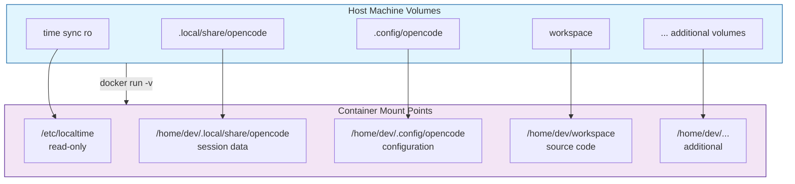
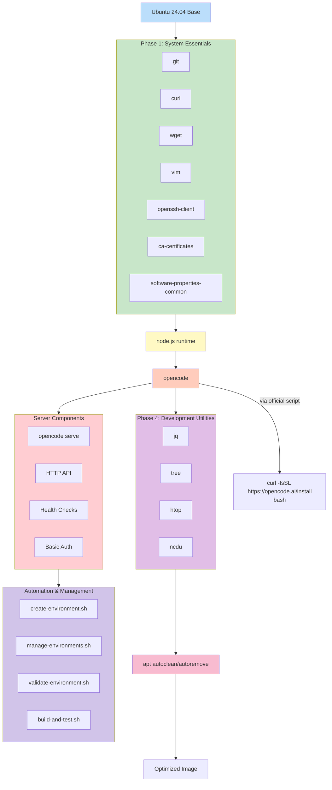

# 📋 Masterplan: OpenCode Development Workspace Environment (Updated)

## 🎯 Core Architecture Overview

### System Architecture Diagram
```
┌─────────────────────────────────────────────────────────────────────┐
│                    UBUNTU 24.04 CONTAINER MASTERPLAN               │
├─────────────────────────────────────────────────────────────────────┤
│                                                                     │
│  ┌─────────────────────────────────────────────────────────────┐   │
│  │                     Base Container Image                    │   │
│  │  ubuntu:24.04 (28.35MB compressed) [1]                     │   │
│  └──────────────────┬──────────────────────────────────────────┘   │
│                     │                                              │
│  ┌──────────────────▼──────────────────────────────────────────┐   │
│  │                    Package Layer                            │   │
│  │  git · curl · node.js · opencode · wget · vim · ssh        │   │
│  │  (Node.js installed BEFORE OpenCode)                       │   │
│  └──────────────────┬──────────────────────────────────────────┘   │
│                     │                                              │
│  ┌──────────────────▼──────────────────────────────────────────┐   │
│  │                  Volume Mount Strategy                      │   │
│  ├─────────────────────────────────────────────────────────────┤   │
│  │  📂 time sync (ro)    → /etc/localtime                     │   │
│  │  📂 .local/share/opencode → /home/dev/.local/share/opencode│   │
│  │  📂 .config/opencode  → /home/dev/.config/opencode         │   │
│  │  📂 workspace         → /home/dev/workspace                │   │
│  │  📂 [additional]      → [custom mount points]              │   │
│  └─────────────────────────────────────────────────────────────┘   │
│                                                                     │
│  ┌─────────────────────────────────────────────────────────────┐   │
│  │                Runtime Configuration                        │   │
│  │  • Non-root user: dev (UID 1000)                           │   │
│  │  • Working directory: /home/dev/workspace                  │   │
│  │  • Shell: bash with custom prompts                         │   │
│  │  • Timezone: synchronized with host                        │   │
│  │  • OpenCode: installed via official script (curl | bash)   │   │
│  └─────────────────────────────────────────────────────────────┘   │
│                                                                     │
└─────────────────────────────────────────────────────────────────────┘
```

### Volume Mounting Strategy (Mermaid Flowchart)


## 📦 Volume Strategy Deep Dive

### Essential Volume Mounts
```
VOLUME CONFIGURATION MATRIX
┌──────────────────────┬────────────────────┬────────────┬────────────────────────┐
│ Volume Purpose       │ Host Path          │ Container  │ Mount Options         │
│                      │                    │ Path       │                       │
├──────────────────────┼────────────────────┼────────────┼────────────────────────┤
│ Time Synchronization │ /etc/localtime     │ /etc/      │ ro (read-only)        │
│                      │                    │ localtime  │ consistent timezone   │
├──────────────────────┼────────────────────┼────────────┼────────────────────────┤
│ OpenCode Session     │ ~/.local/share/    │ /home/dev/ │ rw (read-write)       │
│ Data                 │ opencode           │ .local/    │ persistent sessions   │
│                      │                    │ share/     │                        │
│                      │                    │ opencode   │                        │
├──────────────────────┼────────────────────┼────────────┼────────────────────────┤
│ Global Configuration │ ~/.config/opencode │ /home/dev/ │ rw (read-write)       │
│ & Connected Models   │                    │ .config/   │ shared across all     │
│                      │                    │ opencode   │ containers            │
├──────────────────────┼────────────────────┼────────────┼────────────────────────┤
│ Source Code Workspace│ ./workspace/       │ /home/dev/ │ rw (read-write)       │
│                      │                    │ workspace  │ project files         │
├──────────────────────┼────────────────────┼────────────┼────────────────────────┤
│ Health Check Script  │ ../../base/config/ │ /healthcheck.sh │ ro (read-only)   │
│                      │ healthcheck.sh     │            │ container monitoring   │
├──────────────────────┼────────────────────┼────────────┼────────────────────────┤
│ Entrypoint Script    │ ../../base/config/ │ /entrypoint.sh  │ ro (read-only)   │
│                      │ entrypoint.sh      │            │ container startup      │
├──────────────────────┼────────────────────┼────────────┼────────────────────────┤
│ Base Configuration   │ ../../base/config/ │ /tmp/opencode- │ ro (read-only)     │
│                      │ opencode-base.json │ base.json  │ default config        │
└──────────────────────┴────────────────────┴────────────┴────────────────────────┘
```

### 🔄 Additional Volume Ideas
```
SUGGESTED ADDITIONAL MOUNTS
┌──────────────────────┬─────────────────────────────────────────────┐
│ Volume Type          │ Purpose & Implementation Notes             │
├──────────────────────┼─────────────────────────────────────────────┤
│ 📂 SSH Configuration │ Mount ~/.ssh → /home/dev/.ssh              │
│                      │ • Requires careful permission handling      │
│                      │ • Consider SSH agent forwarding as alt     │
├──────────────────────┼─────────────────────────────────────────────┤
│ 📂 Git Configuration │ Mount ~/.gitconfig → /home/dev/.gitconfig  │
│                      │ • Shared git settings across workspaces    │
│                      │ • Can be combined with SSH config          │
├──────────────────────┼─────────────────────────────────────────────┤
│ 📂 TLS/SSL Certs     │ Mount /etc/ssl/certs → /etc/ssl/certs      │
│                      │ • For corporate certificate environments    │
│                      │ • Read-only mount for security             │
├──────────────────────┼─────────────────────────────────────────────┤
│ 📂 Package Cache     │ Host volume for APT/Node cache             │
│                      │ • Speeds up container rebuilds             │
│                      │ • Shared cache across containers           │
├──────────────────────┼─────────────────────────────────────────────┤
│ 📂 Tool Configs      │ Mount ~/.config/tools → /home/dev/.config/ │
│                      │ • IDE/editor configurations                │
│                      │ • Shell customizations                     │
└──────────────────────┴─────────────────────────────────────────────┘
```

## 🛠️ Package Installation Strategy (Updated)

### Base Package Installation Plan
```
PACKAGE INSTALLATION HIERARCHY
┌─────────────────────────────────────────────────────────────────────┐
│                     Package Installation Order                      │
├─────────────────────────────────────────────────────────────────────┤
│  PHASE 1: System Essentials                                        │
│  └── 📦 git        - Version control system                        │
│      📦 curl       - HTTP client for downloads                     │
│      📦 wget       - Alternative download utility                  │
│      📦 vim        - Text editor for config edits                  │
│      📦 openssh-client - SSH client functionality                  │
│      📦 ca-certificates - SSL certificate management               │
│      📦 software-properties-common - Repository management         │
│                                                                     │
│  PHASE 2: Node.js Runtime (PREREQUISITE)                           │
│  └── 📦 node.js    - JavaScript runtime (from NodeSource repo)     │
│      📦 npm        - Node package manager (often bundled)          │
│      📦 build-essential - Compiler toolchain for native modules    │
│                                                                     │
│  PHASE 3: OpenCode Installation via Official Script                │
│  └── 📦 opencode   - Via official install script:                  │
│          curl -fsSL https://opencode.ai/install | bash [1]         │
│      • Followed by configuration:                                  │
│          - Run `/connect` in TUI and authenticate                  │
│          - Configure API keys for LLM providers                    │
│          - Consider OpenCode Zen for beginners [1]                 │
│                                                                     │
│  PHASE 4: Development Utilities                                    │
│  └── 📦 jq         - JSON processor for config manipulation       │
│      📦 tree       - Directory visualization                       │
│      📦 htop       - Process monitoring                           │
│      📦 ncdu       - Disk usage analyzer                          │
│                                                                     │
│  PHASE 5: Cleanup                                                  │
│  └── 🧹 apt autoclean && apt autoremove - Reduce image size       │
└─────────────────────────────────────────────────────────────────────┘
```

### 🔄 Additional Package Ideas
```
ENHANCEMENT PACKAGES
┌──────────────────────┬─────────────────────────────────────────────┐
│ Package Category     │ Specific Packages & Justification          │
├──────────────────────┼─────────────────────────────────────────────┤
│ 📦 Shell Enhancements│ zsh, oh-my-zsh, powerline fonts            │
│                      │ • Improved developer experience             │
│                      │ • Customizable prompts                      │
├──────────────────────┼─────────────────────────────────────────────┤
│ 📦 Version Control   │ git-lfs, git-flow, tig                     │
│ Extensions           │ • Large file support                        │
│                      │ • Advanced git workflows                    │
│                      │ • Terminal git browser                      │
├──────────────────────┼─────────────────────────────────────────────┤
│ 📦 Container Tools   │ docker.io, docker-compose-plugin           │
│                      │ • Docker-in-Docker capability               │
│                      │ • Useful for CI/CD within workspace         │
├──────────────────────┼─────────────────────────────────────────────┤
│ 📦 Network Utilities │ net-tools, dnsutils, iputils-ping          │
│                      │ • Network diagnostics                       │
│                      │ • DNS resolution testing                    │
├──────────────────────┼─────────────────────────────────────────────┤
│ 📦 Security Tools    │ gnupg, openssl, ca-certificates            │
│                      │ • Package signing verification              │
│                      │ • SSL/TLS certificate management            │
└──────────────────────┴─────────────────────────────────────────────┘
```

## 🌐 Server Deployment Architecture

### Server Mode Configuration
- **Default Operation**: Containers run `opencode serve` instead of bash shell
- **HTTP API**: Exposes OpenAPI 3.1 spec at `/doc` endpoint
- **Health Monitoring**: `/global/health` endpoint for container health checks
- **Authentication**: HTTP Basic Auth with configurable username/password
- **Port Management**: Auto-incremented ports (4096, 4097, 4098...) per environment

### Remote Access Configuration
```
CONNECTION MATRIX
┌────────────────────┬─────────────────────────────────────────────────────┐
│ Access Method      │ Configuration & Command                            │
├────────────────────┼─────────────────────────────────────────────────────┤
│ OpenCode TUI       │ opencode --host localhost --port 4096 \           │
│                    │       --username opencode --password <password>    │
├────────────────────┼─────────────────────────────────────────────────────┤
│ API Documentation  │ http://localhost:4096/doc                         │
├────────────────────┼─────────────────────────────────────────────────────┤
│ Health Check       │ http://localhost:4096/global/health               │
├────────────────────┼─────────────────────────────────────────────────────┤
│ Container Shell    │ docker compose exec opencode-dev1 bash            │
└────────────────────┴─────────────────────────────────────────────────────┘
```

### Environment Variables for Server Mode
- `OPENCODE_SERVER_ENABLED=true` - Enable/disable server mode
- `OPENCODE_SERVER_HOST=0.0.0.0` - Bind to all interfaces
- `OPENCODE_SERVER_PORT=4096` - Server port (auto-incremented)
- `OPENCODE_SERVER_USERNAME=opencode` - Basic auth username
- `OPENCODE_SERVER_PASSWORD=` - **REQUIRED**: Secure password
- `OPENCODE_SERVER_CORS=` - Optional CORS origins

## 🏗️ Implementation Architecture

### File System Layout Design
```
CONTAINER FILESYSTEM STRUCTURE
/home/dev/
├── 📁 .local/share/opencode/    ← MOUNTED: Session data
│   ├── 📁 cache/                - AI model cache
│   ├── 📁 sessions/             - Individual session states
│   └── 📁 temp/                 - Temporary files
│
├── 📁 .config/opencode/         ← MOUNTED: Global config
│   ├── 📄 config.json           - OpenCode configuration
│   ├── 📁 models/               - Connected model definitions
│   └── 📁 providers/            - AI provider configurations
│
├── 📁 workspace/                ← MOUNTED: Source code
│   └── ... (project files)
│
├── 📁 .ssh/                     ← OPTIONAL MOUNT: SSH config
│   ├── 📄 id_ed25519            - SSH private key (secured)
│   └── 📄 known_hosts           - Trusted hosts
│
├── 📁 .config/tools/            ← OPTIONAL MOUNT: Tool configs
│   ├── 📁 vscode/               - VS Code settings
│   ├── 📁 git/                  - Additional git configs
│   └── 📄 .bashrc               - Shell customizations
│
└── 📁 .opencode/                ← INSTALLED: OpenCode binaries
    ├── 📁 bin/                  - Executable binaries
    └── 📁 lib/                  - Library files

/ (root)
├── 📄 entrypoint.sh             ← MOUNTED: Container entrypoint
├── 📄 healthcheck.sh            ← MOUNTED: Health check script
└── 📄 opencode-base.json        ← MOUNTED: Base configuration
```

### Package Dependency Graph


## 🤖 Automation & Management System

### Management Scripts
- **`create-environment.sh`** - Automated environment creation with auto-incremented UIDs/ports
- **`manage-environments.sh`** - Multi-environment management (build, start, stop, status)
- **`validate-environment.sh`** - Comprehensive environment validation
- **`build-and-test.sh`** - Complete build and test pipeline
- **`setup-network.sh`** - Shared Docker network setup
- **`debug-nodejs.sh`** - Node.js installation troubleshooting

### Environment Creation Workflow
1. **Automated Creation**: `./create-environment.sh dev3`
2. **Password Configuration**: Set `OPENCODE_SERVER_PASSWORD` in `.env`
3. **Build & Start**: `cd environments/dev3 && docker compose build && docker compose up -d`
4. **Validation**: `./validate-environment.sh dev3`
5. **Connection**: `opencode --host localhost --port <assigned-port> --username opencode --password <password>`

### Multi-Environment Operations
```
OPERATIONS MATRIX
┌────────────────────┬─────────────────────────────────────────────────────┐
│ Operation          │ Command                                            │
├────────────────────┼─────────────────────────────────────────────────────┤
│ List Environments  │ ./manage-environments.sh list                      │
│ Build All          │ ./manage-environments.sh build-all                 │
│ Start All          │ ./manage-environments.sh start-all                 │
│ Stop All           │ ./manage-environments.sh stop-all                  │
│ Check Status       │ ./manage-environments.sh status                    │
│ Execute Command    │ ./manage-environments.sh exec <env> <command>      │
│ View Logs          │ ./manage-environments.sh logs <env>                │
└────────────────────┴─────────────────────────────────────────────────────┘
```

## 🗓️ Implementation Phases

### Phase 1: Foundation & Base Image
**Objective**: Create minimal Ubuntu 24.04 base with essential packages
- **Effort**: Medium
- **Activities**:
  - Start from `ubuntu:24.04` (28.35MB layer)
  - Install system essentials: git, curl, wget, vim, openssh-client
  - Configure non-root user 'dev' (UID 1000)
  - Set up working directory structure
  - Implement APT cache cleanup in same layer

### Phase 2: Node.js Runtime Installation (Updated)
**Objective**: Install Node.js as prerequisite for OpenCode
- **Effort**: Medium
- **Activities**:
  - Add Node.js from NodeSource repository (LTS version)
  - Install npm (Node package manager)
  - Add build-essential for native module compilation
  - Configure global npm installation directory
  - Verify Node.js installation with `node --version`

### Phase 3: OpenCode Installation via Official Script (Updated)
**Objective**: Install OpenCode using the official installation script
- **Effort**: High
- **Activities**:
  - Run OpenCode installation: `curl -fsSL https://opencode.ai/install | bash` [1]
  - Configure OpenCode for Docker Model Runner integration [10]
  - Set up default configuration templates
  - Create volume mount points for `.config/opencode` and `.local/share/opencode`
  - Test OpenCode basic functionality and connectivity

### Phase 4: Volume Mount Configuration
**Objective**: Define and implement volume strategy
- **Effort**: Medium
- **Activities**:
  - Design volume mount points in container
  - Create Docker Compose configuration for multi-container setup [18]
  - Implement time synchronization mount (`/etc/localtime`)
  - Configure workspace directory mounting
  - Set up optional volume mounts (SSH, git, tool configs)

### Phase 5: Development Environment Polish
**Objective**: Add quality-of-life improvements and utilities
- **Effort**: Low
- **Activities**:
  - Install development utilities: jq, tree, htop, ncdu
  - Configure shell prompts and aliases
  - Set up Git configuration templates
  - Add container health check scripts
  - Create entrypoint script for container initialization

### Phase 6: Security & Access Configuration
**Objective**: Implement secure access patterns
- **Effort**: High
- **Status**: 🔄 In Progress
- **Activities**:
  - ✅ HTTP Basic Authentication for server access
  - ✅ Environment variable injection for secrets
  - ✅ User namespace mapping (UID/GID)
  - ✅ Read-only mounts for system files and shared models
  - 🔄 SSH key mounting with proper permissions
  - 🔄 Container network security policies
  - 🔄 SSL/TLS certificate management

### Phase 7: Optimization & Productionization
**Objective**: Optimize image and prepare for production use
- **Effort**: Very High
- **Status**: ⏳ Planned
- **Activities**:
  - Implement multi-stage builds for smaller final images
  - Optimize layer ordering for Docker cache efficiency
  - Create development vs production image variants
  - Add health checks and monitoring endpoints
  - Document image building and deployment processes
  - Implement resource limits and monitoring

### Phase 8: Server Deployment & Remote Access
**Objective**: Implement OpenCode server mode with secure remote access
- **Effort**: Medium
- **Status**: ✅ Completed
- **Activities**:
  - ✅ Configure OpenCode server mode with `opencode serve`
  - ✅ Implement HTTP Basic Authentication for API security
  - ✅ Set up port mapping and host network configuration
  - ✅ Create health check endpoints for container monitoring
  - ✅ Develop automation scripts for environment management
  - ✅ Document remote access patterns for OpenCode TUI
  - ✅ Implement auto-incremented port assignment

## 🔒 Security & Authentication

### Authentication Layers
1. **Container Isolation**: Unique UID/GID per environment prevents cross-container access
2. **Network Security**: Shared Docker network with internal DNS (`*.opencode.local`)
3. **API Authentication**: HTTP Basic Auth with configurable credentials
4. **Volume Security**: Read-only mounts for system files and shared models
5. **User Mapping**: Host user UID/GID mapping for file permission consistency

### Security Best Practices
- **Required**: Set `OPENCODE_SERVER_PASSWORD` for each environment
- **Recommended**: Use different passwords per environment
- **Optional**: Configure CORS origins for web client access
- **Monitoring**: Regular health checks and log monitoring
- **Updates**: Keep base image and packages updated for security patches

### Environment Security Configuration
```bash
# Minimum security configuration
OPENCODE_SERVER_PASSWORD=your-secure-password-here
OPENCODE_SERVER_USERNAME=opencode

# Enhanced security (optional)
OPENCODE_SERVER_CORS=http://localhost:5173,https://app.example.com
MEMORY_LIMIT=2g
CPU_LIMIT=1.0
```

---
**Masterplan Status**: 🚀 PARTIALLY IMPLEMENTED  
**Last Updated**: March 10, 2026  
**Implementation Progress**:  
- ✅ **Phases 1-5**: Completed (Foundation, Node.js, OpenCode, Volume Mounts, Polish)  
- 🔄 **Phase 6**: In Progress (Security & Access Configuration)  
- ⏳ **Phase 7**: Planned (Optimization & Productionization)  
- 🆕 **Phase 8**: Added (Server Deployment & Remote Access)  

**Key Updates**:  
1. Node.js is now explicitly installed as a prerequisite before OpenCode installation via the official script [1]  
2. OpenCode server mode implemented with HTTP API and remote access  
3. Automated environment management with unique UIDs and auto-incremented ports  
4. Basic authentication and health monitoring for secure container operation  
5. Comprehensive automation scripts for environment lifecycle management

**References**:  
[1] OpenCode Installation: https://opencode.ai/docs  
[2] OpenCode Server Documentation: https://opencode.ai/docs/server  
[3] Docker Compose Documentation: https://docs.docker.com/compose/  
[4] NodeSource Node.js Distribution: https://github.com/nodesource/distributions  
[5] Ubuntu 24.04 Base Image: https://hub.docker.com/_/ubuntu